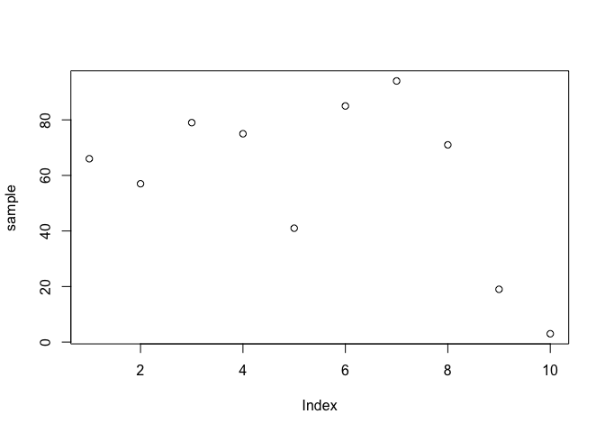
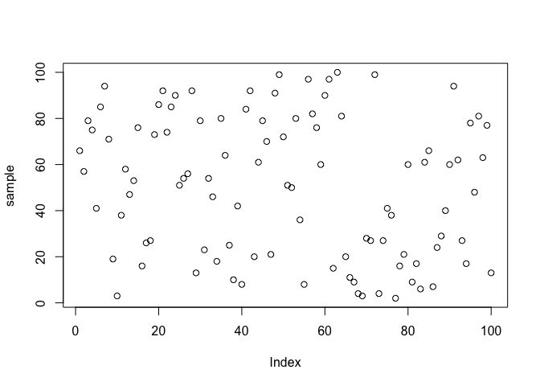

Assignment 1
================
Jaimie Chin
2023-02-01

# Question 1

A researcher collects the ages of students in a graduate program to get
a sense if how old people are in the program.

## a. Create a data set in R using the above data (using data.frame() would help)

``` r
# Create a dataframe of participants and their age

ages = data.frame(Participants = c(1, 2, 3, 4, 5, 6, 7, 8, 9, 10, 11, 12, 13, 14, 15),
                  Participant_Age = c(28, 23, 28, 30, 24, 30, 20, 25, 29, 24, 24, 24, 20, 28, 29))

ages
```

    ##    Participants Participant_Age
    ## 1             1              28
    ## 2             2              23
    ## 3             3              28
    ## 4             4              30
    ## 5             5              24
    ## 6             6              30
    ## 7             7              20
    ## 8             8              25
    ## 9             9              29
    ## 10           10              24
    ## 11           11              24
    ## 12           12              24
    ## 13           13              20
    ## 14           14              28
    ## 15           15              29

## b. What is the mean? What is the median? What is the mode?

``` r
# Create a function to find the mode of a set of data
getMode = function(v) {
  uniq = unique(v)
  uniq[which.max(tabulate(match(v, uniq)))]
}
```

``` r
# Find the mean of ages in the sample
mean = mean(ages$Participant_Age)
sprintf("The mean age in this sample is: %s", mean)
```

    ## [1] "The mean age in this sample is: 25.7333333333333"

``` r
# Find the median of ages in the sample
median = median(ages$Participant_Age)
sprintf("The median age in this sample is: %s", median)
```

    ## [1] "The median age in this sample is: 25"

``` r
# Find the mode of ages in the sample
mode = getMode(ages$Participant_Age)
sprintf("The mode age in this sample is: %s", mode)
```

    ## [1] "The mode age in this sample is: 24"

## c. What can you say about the three measures of central tendency?

The three measures of central tendency are relatively similar (\~25).
This tells us that the data set of Participant Ages do not have
extraneous outliers that may have affected the mean of ages. Therefore,
because all three measures of central tendency are \~25 years of age, it
lets us know that the normal or ‘average’ age for the participants in
this sample is 25.

# Question 2

Create a random selection of 10 numbers ranging from 1 to 100 (using the
sample() function with replace set to TRUE). You’ll need to store this
sample into an object (i.e., create a variable) so that you can do
calculations with the sample.

``` r
# Create a sample following the parameters 
sample = sample(1:100, 10, replace=TRUE)
sample
```

    ##  [1]  70  47  35  80  67  62  21   9  43 100

## a. What is the median? What is the mean? Is there a difference between the two? Why?

``` r
# Find the mean of the sample
mean = mean(sample)
sprintf("The mean in this sample is: %s", mean)
```

    ## [1] "The mean in this sample is: 53.4"

``` r
# Find the median of the sample
median = median(sample)
sprintf("The median in this sample is: %s", median)
```

    ## [1] "The median in this sample is: 54.5"

Yes, there is a minor difference between the mean and median. This is
most likely the case because the sample of 10 values, while randomly
samples, is skewed slightly towards the left – or the sample contains
more values closer to the left end of the sample. This happens because
the mean outlines the center of gravity of data set whereas median
highlights the middle-most value of the data set.

## b. Compute the standard deviation

``` r
# Compute the standard deviation of the sample
sd = sd(sample)
sprintf("The standard deviation of this sample is: %s", sd)
```

    ## [1] "The standard deviation of this sample is: 27.7336538443018"

## c. Create a plot to visualize these data

``` r
# Create a scatter plot of the sample values
plot(sample)
```

<!-- -->

Now create a random sample of 100 numbers ranging from 1 to 100 (again,
using the sample() function with replace set to TRUE).

``` r
# Create a sample following the parameters 
sample = sample(1:100, 100, replace=TRUE)
sample
```

    ##   [1]  54  97  71  25   9  22   7  43  19  58  48   3   2  40  64  30  66  93
    ##  [19]  27  42  30  28   9  22  43  90  16  22  48  63  51  76  91  22  48  38
    ##  [37]   7  27  73  40  19  57  33  33  95  21  40  37  63  19  94  87  89  26
    ##  [55]   4  99  63  44  50  20  63  38  54   8  27   6  73 100   3  79  46  10
    ##  [73]  83  12  85  93  17  69  99   9   8  53  70  67  74  38  63   5   5  20
    ##  [91]  65  33  47   3  58  14  39  13   5  97

## a. What is the median, mean, and standard deviation of this sample?

``` r
# Find the mean of the sample
mean = mean(sample)
sprintf("The mean in this sample is: %s", mean)
```

    ## [1] "The mean in this sample is: 44.08"

``` r
# Find the median of the sample
median = median(sample)
sprintf("The median in this sample is: %s", median)
```

    ## [1] "The median in this sample is: 40"

``` r
# Compute the standard deviation of the sample
sd = sd(sample)
sprintf("The standard deviation of this sample is: %s", sd)
```

    ## [1] "The standard deviation of this sample is: 29.2808345633671"

## b. Create a plot to visualize these data

``` r
# Create a scatter plot of the sample values
plot(sample)
```

<!-- -->

## c. How do these values from your sample of 100 compare to your first sample of 10? Are they similar/different? Why? \[If you expected them to be similar and they are not (or vice versa), why aren’t they similar (or different)?\]

I expected both the sample of 100 values and 10 values to have no
distinct correlation since they are both random samples. Observing both
of the plots, the plot with 100 values is more clearly random, but the
plot with 10 values also shows a non-correlational relationship between
the points. Furthermore, the high standard deviation for both samples
tell us that the data is greatly dispersed in relation to the mean,
which deters a correlation between the values.

# Question 3

A researcher wants to study the impact of the presence (in the room) of
a sweet snack on task completion. 30 participants are given 5 logic
problems to solve. Half of the participants are randomly assigned to
desks that have only a pencil and the word problems. The remaining
participants are assigned to desks with a pencil, the same word
problems, and a candy dispenser. Participants are timed and the
completion times are recorded. These are the times (in seconds)

``` r
# Create a dataframe of Candy_Absent group

candy_absent = data.frame(Participant = c(1, 2, 3, 4, 5, 6, 7, 8, 9, 10, 11, 12, 13, 14, 15),
                  Reaction_Time = c(501, 536, 659, 317, 530, 523, 381, 573, 535, 509, 604, 704, 370, 440, 404))

candy_absent
```

    ##    Participant Reaction_Time
    ## 1            1           501
    ## 2            2           536
    ## 3            3           659
    ## 4            4           317
    ## 5            5           530
    ## 6            6           523
    ## 7            7           381
    ## 8            8           573
    ## 9            9           535
    ## 10          10           509
    ## 11          11           604
    ## 12          12           704
    ## 13          13           370
    ## 14          14           440
    ## 15          15           404

``` r
# Create a dataframe of Candy_Present group

candy_present = data.frame(Participant = c(16, 17, 18, 19, 20, 21, 22, 23, 24, 25, 26, 27, 28, 29, 30),
                  Reaction_Time = c(690, 691, 510, 586, 675, 470,  533, 693, 440, 614, 475, 374, 500, 478, 664))

candy_present
```

    ##    Participant Reaction_Time
    ## 1           16           690
    ## 2           17           691
    ## 3           18           510
    ## 4           19           586
    ## 5           20           675
    ## 6           21           470
    ## 7           22           533
    ## 8           23           693
    ## 9           24           440
    ## 10          25           614
    ## 11          26           475
    ## 12          27           374
    ## 13          28           500
    ## 14          29           478
    ## 15          30           664

## a. Compute the mean and median for both groups. What do you think about the results you’ve computed?

``` r
# Find the mean of reaction times in the Candy Absent group
mean = mean(candy_absent$Reaction_Time)
sprintf("The mean reaction time in the Candy-Absent group is: %s", mean)
```

    ## [1] "The mean reaction time in the Candy-Absent group is: 505.733333333333"

``` r
# Find the median of reaction time in the Candy Absent group
median = median(candy_absent$Reaction_Time)
sprintf("The median reaction time in the Candy-Absent group: %s", median)
```

    ## [1] "The median reaction time in the Candy-Absent group: 523"

``` r
# Find the mean of reaction times in the Candy Present group
mean = mean(candy_present$Reaction_Time)
sprintf("The mean reaction time in the Candy-Present group is: %s", mean)
```

    ## [1] "The mean reaction time in the Candy-Present group is: 559.533333333333"

``` r
# Find the median of reaction time in the Candy Present group
median = median(candy_present$Reaction_Time)
sprintf("The median reaction time in the Candy-Present group: %s", median)
```

    ## [1] "The median reaction time in the Candy-Present group: 533"

Observing the mean and median for both groups, it is clear that the
group with Candy-Present has generally higher values of reaction time.
Meaning, the group with candy on average took more time to solve the
word-problems.

## b. If you changed the highest score in the Candy-Absent group to be 10 times the original value, what would happen to the mean? What about median?

I would expect the mean to be largely affected by this change as the
mean is more sensitive to outliers. I would expect nothing to change
with the median as the order and number of values will remain the same,
which would not affect the middle value of the group sample.

``` r
# Find the index of the max reaction time in the Candy Absent group
max_time = which.max(candy_absent$Reaction_Time)

# Create a copy of the candy_absent data frame and change the value of the highest score 
candy_absent_copy = cbind(candy_absent)
candy_absent_copy = replace(candy_absent_copy$Reaction_Time, candy_absent_copy$Participant == max_time, (candy_absent_copy$Reaction_Time[candy_absent_copy$Participant == max_time]*10))

# Find the mean of reaction times in the altered Candy Absent group
mean = mean(candy_absent_copy)
sprintf("The mean reaction time in the altered Candy-Absent group is: %s", mean)
```

    ## [1] "The mean reaction time in the altered Candy-Absent group is: 928.133333333333"

``` r
# Find the median of reaction time in the altered Candy Absent group
median = median(candy_absent_copy)
sprintf("The median reaction time in the altered Candy-Absent group: %s", median)
```

    ## [1] "The median reaction time in the altered Candy-Absent group: 523"

## c. If you changed the highest score in the Candy-Present group to be one tenth is original value, what would happen to the mean? What about the median?

I would expect the mean to be still affected by this change as the mean
is more sensitive to outliers and scaling a value to be smaller (one
tenth of its original value), would be an outlier. I would expect the
median to change as well, because now the highest score will be the
smallest score, which affects the order of the values, which would
affect the middle value of the group sample.

``` r
# Find the index of the max reaction time in the Candy Present group
max_time = which.max(candy_present$Reaction_Time)
max_time = candy_present$Participant[[max_time]]

# Create a copy of the candy_present data frame and change the value of the highest score 
candy_present_copy = cbind(candy_present)
candy_present_copy = replace(candy_present_copy$Reaction_Time, candy_present_copy$Participant == max_time, (candy_present_copy$Reaction_Time[candy_present_copy$Participant == max_time]*0.1))

# Find the mean of reaction times in the altered Candy Present group
mean = mean(candy_present_copy)
sprintf("The mean reaction time in the altered Candy-Present group is: %s", mean)
```

    ## [1] "The mean reaction time in the altered Candy-Present group is: 517.953333333333"

``` r
# Find the median of reaction time in the altered Candy Present group
median = median(candy_present_copy)
sprintf("The median reaction time in the altered Candy-Present group: %s", median)
```

    ## [1] "The median reaction time in the altered Candy-Present group: 510"

# Question 4

A teacher developed a new studying technique and was interested in
seeing if it worked. To test this, they had students take a test before
using the studying technique (to get a baseline score) and then had
students take a similar test one week later (after using the studying
technique).

``` r
# Create a dataframe of scores

scores = data.frame(Participant = c(1, 2, 3, 4, 5, 6, 7, 8, 9, 10, 11, 12, 13),
                  Pre_Test = c(4, 5, 6, 7, 4, 7, 5, 9, 6, 8, 2, 8, 3),
                  Post_Test = c(6, 6, 5, 8, 8, 5, 6, 9, 4, 8, 5, 7, 2))

scores
```

    ##    Participant Pre_Test Post_Test
    ## 1            1        4         6
    ## 2            2        5         6
    ## 3            3        6         5
    ## 4            4        7         8
    ## 5            5        4         8
    ## 6            6        7         5
    ## 7            7        5         6
    ## 8            8        9         9
    ## 9            9        6         4
    ## 10          10        8         8
    ## 11          11        2         5
    ## 12          12        8         7
    ## 13          13        3         2

## a. Plot participants’ pre- and post-test scores in a single plot. What do you see? Does there appear to be a relationship between their scores before and after using the studying technique?

``` r
# Plot Pre-Test & Post-Test 
plot(scores$Pre_Test, scores$Post_Test, pch=19, col="red", xlab = "Pre-Test Score", ylab = "Post-Test Score")
```

<!-- -->

It is difficult to discern from the plot if there is a relationship
between scores before and after using the studying technique. Vaguely,
it appears that there is somewhat of a positive correlation between pre-
and post-test scores – meaning students who performed higher on the
pre-test are likely to also perform higher on the post-test.

## b. Now check to see if there is a correlation between participants’ pre- and post-test scores. What is the correlation? You can use the cor() function in R.

``` r
# Find the correlation between participants’ pre- and post-test scores
corr = cor(scores$Pre_Test, scores$Post_Test)
sprintf("The correlation between participants' pre- and post-test scores is: %s", corr)
```

    ## [1] "The correlation between participants' pre- and post-test scores is: 0.581405769696434"

## c. What do you think of this teacher’s experiment to test their studying technique? Do you think they did a good experiment to yield appropriate data to test the effectiveness of their studying technique?

No, I do not think the teacher’s experiment to test the *effectiveness*
of their studying technique was a good experiment. Using a correlation
to find the relationship between the pre- and post-test tells us nothing
about how the *studying technique* positively effected the scores of
students – it only tells us how the pre- and post-test scores are
related (may be dependent on student’s innate ability).

### If yes, why? Be concrete about what you think the teacher did right.

### If no, give one suggestion (besides running with a larger sample size) the teacher could do to improve their experiment?

I would suggest for the teacher to implement a control group that does
not utilize the studying technique and test group that does utilize the
studying technique. By doing this, the teacher can clearly use a
comparison of mean scores (t-test) to identify how effective using the
studying method is compared to not using the studying method.
